# iqlink &nbsp;[](https://pkg.go.dev/github.com/iqhive/iqlink)

<p align="center">
  
</p>

## Background:

This project was originally published as open source by IQ Hive
under the runtime.link import path. Following a maintainer’s departure
from IQ Hive, the vanity domain was redirected to that maintainer’s
separate repository without prior notice to IQ Hive. Development
has continued independently in both repositories. IQ Hive’s version now
uses direct GitHub import paths so applications can reliably depend on
the implementation maintained here as it contains features that other
open source IQ Hive project depend on.

In order to avoid confusion between the 2 similar-named but divergent
feature-sets, this project was renamed iqlink.

iqlink will continue to automatically import features from the
runtime.link implementation for a period of time, or until such time
as the features conflict in a way that prevents this happening.

## Summary

One Go API specification can support several ways of calling the same software.
Define the interface in Go source, then use iqlink's runtime linkers to connect it
to an implementation.

iqlink provides a dictionary for expressing software interfaces in Go source.
Its Go linkers connect those interface definitions to implementations at runtime
through network protocols such as HTTP, command line interfaces, or native
application binary interfaces (ABIs) on supported platforms.

- Describe operations with typed structures, function fields and tags that record
  how each operation is exposed.
- Call or serve HTTP APIs, run command line programs, and connect to native
  libraries through supported ABIs.
- Inspect calls with `xray` and create empty implementations with `stub` for
  development and debugging.

iqlink is still in development. We aim to keep established components stable,
but minor breaking changes remain possible before the first stable release.

Example:
```go
// Package example provides the specification for the iqlink example API.
package example

import (
	"log"
	"os"

	"github.com/iqhive/iqlink/api"
)

// API specification structure, typically named API for general structures, may
// be more suitably named Functions, Library or Command when the API is
// restricted to a specific iqlink layer. Any Go comments in the source
// are intended to document design notes and ideas. This leaves Go struct tags
// for recording developer-facing documentation.
type API struct {
	api.Specification `api:"Example" cmd:"example" lib:"libexample"
		is an example of an iqlink API structure.` // this section of the tag contains documentation.

	// HelloWorld includes iqlink tags that specify how the function is called
	// across different link-layers. Typically, a context.Context argument and error
	// return value should be included here, they are omitted here for brevity.
	HelloWorld func() string `cmdl:"hello_world" link:"example_helloworld func()$char" rest:"GET /hello_world"
		returns the string "Hello World"` // documentation for the function.
}

// New returns an implementation of the API. This doesn't have to be defined in the
// same package and may not even be implemented in Go. This will often be the case when
// representing an external API controlled by a third-party.
func New() API {
	return API{
		HelloWorld: func() string {
			return "Hello World"
		},
	}
}
```

## More Practical Examples

* [Quickly use REST API endpoints in Go without the need for a Go 'client library'](api/example/Link.md)
* [examples/simple](examples/simple): a specification and implementation run as a command line with `cmdl`.
* [examples/http](examples/http): a notes API served over HTTP by one command and called by another, sharing one specification package.
* [examples/advanced](examples/advanced): a bookshop with namespaces, declared errors and HTTP statuses, token authentication and authorization, error redaction, a dependency on a second API, request interception and a `stub` test double.

Run any of them with `go run`, for example `go run ./examples/advanced`; each directory's tests check the output shown in its comments.

## Runtime Linkers.
Each linker lives under the `api` package and enables an API to be linked against a host
implementation via a standard communication protocol. A linker can also serve a host
implementation written in Go.

Currently available iqlink linkers include:

    * cmdl - parse command line arguments or execute command line programs.
    * link - generate c-shared export directives or dynamicaly link to shared libraries (via ABI).
    * rest - link to, or host a REST API server over the network.
    * stub - create a stub implementation of an API, that returns empty values or errors.
    * xray - debug linkers with API call introspection.

## Parameter names

API structures can opt in to exposing the Go parameter and result names
written in their `func` fields, so linkers can use them as defaults
(REST body/result mapping, cmdl help text, wasm debug names). Explicit
struct tags always win; names are never required.

```go
//go:embed *.go
var source embed.FS

func (API) Source() fs.FS { return source }
```

Alternatively, `api.RegisterSource[API](files)` associates source with
every struct type in that package. The source is parsed once per
package; failure to obtain names is silent. Embedding `.go` files
increases binary size and ships the spec source in the binary — for
single-file specs prefer `//go:embed api.go`.

## Our Design Values

1. Full readable words for exported identifiers rather than abbreviations ie. `PutString` over `puts`.
2. Acronyms as package names and/or as a suffix, rather than mixed use ie. `TheExampleAPI` over `TheAPIExample`.
3. Explicitly tagged types that define data relationships rather than implicit use of primitives. `Customer CustomerID` over `Customer string`.
4. Don't stutter exported identifiers. `customer.Account` over `customer.Customer`.

## Contribution Guidance

Apart from what's on the Roadmap, we cannot accept any pull requests for new top level
packages at this time, although you are welcome to start a GitHub Discussion for any
ideas you may have, our current goal for iqlink is to stick to a well-defined
and cohesive design space.

iqlink aims to be dependency free, we will not accept any pull requests that add
any additional Go dependencies to the project.

**NOTE**: we adopt a different convention for Go struct tags, which are permitted to be
multi-line and include inline-documentation on subsequent lines of the tag. This can
raise a warning with Go linters, so we recommend using the following configurations:

govet
`go vet -structtag=false ./...`

VS Code + gopls
```json
"go.vetFlags": [
    "-structtag=false"
],
"gopls": {
    "analyses": {
        "structtag": false
    },
},
```

Zed:
```json
"lsp": {
  "gopls": {
    "initialization_options": {
      "analyses": {
        "structtag": false
      }
    }
  }
}
```

golangci-lint.yml
```yaml
linters-settings:
  govet:
    disable:
      - structtag # support iqlink convention.
```

## Roadmap

* Support for additional linkers, such as `mock`, `grpc`, `soap`, `jrpc`, `xrpc`, and `sock`.
